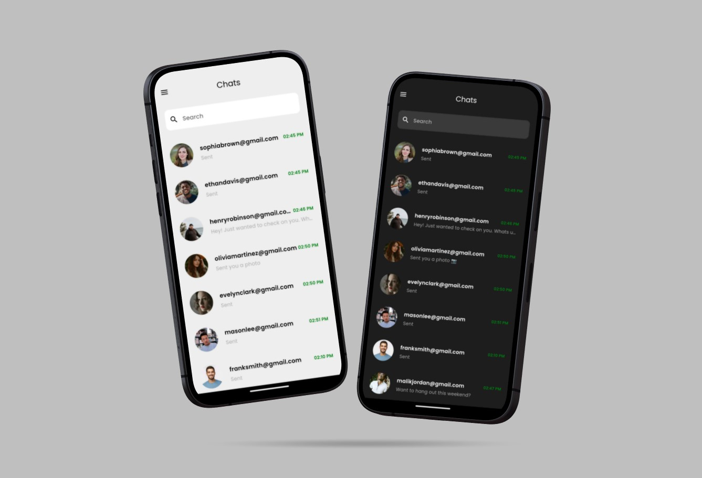

<h1 align="left">Sync - A Minimal and Modern Chat App</h1>

###

A modern chat app with a minimal UI, featuring dark/light mode, profile uploading, image sharing, and more.

###

## Table of Contents
- [Overview](#overview)
- [Features](#features)
- [Technologies Used](#technologies-used)
- [Installation](#installation)
- [License](#license)
- [Contact](#contact)

## Overview

## Technologies Used

###

  
  
  
  
  
  
  <a href="https://www.figma.com/" target="_blank" rel="noreferrer"> 

###

- **Framework**: [Flutter](https://flutter.dev/) – Used for building the cross-platform UI of the app with a modern and minimal design.
- **Design Tool**: [Figma](https://www.figma.com/) – Utilized for prototyping and designing the front-end UI components, ensuring a sleek and user-friendly interface.
- **Backend Services**: [Firebase](https://firebase.google.com/) – Employed for handling user authentication, real-time database management, cloud storage for profile images and shared content, and push notifications.

###

## Contact

  
  

