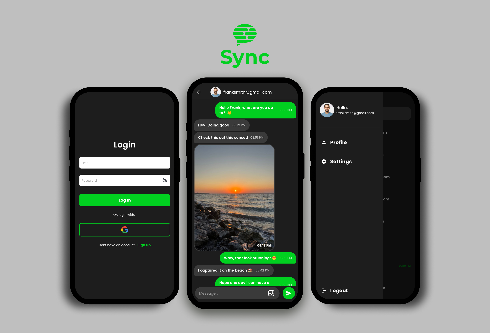

<h1 align="left">Sync - A Minimal and Modern Chat App</h1>

###

A modern chat app with a minimal UI, featuring dark/light mode, profile uploading, image sharing, and more.

### The idea behind the App

Sync was created with a focus on simplicity and functionality. The goal is to offer a chat experience that’s free from unnecessary features and clutter. Many apps today are packed with excessive features, making them harder to navigate and use. With Sync, I wanted to go in the opposite direction, building an app that’s minimalistic, intuitive, and user-friendly.

Every feature in Sync is designed to serve a purpose, making it easy for users to connect and share without being overwhelmed by options they don’t need. With essentials like dark/light mode, profile uploading, and image sharing and more, Sync provides a straightforward and enjoyable chat experience that users can rely on.

###

## Table of Contents
- [Showcase](#showcase)
- [Technologies Used](#technologies-used)
- [License](#license)
- [Contact](#contact)

## Showcase

## Technologies Used

###

  
  
  
  
  
  
  <a href="https://www.figma.com/" target="_blank" rel="noreferrer"> 

###

- **Framework**: [Flutter](https://flutter.dev/) – For building the cross-platform UI of the app with a modern and minimal design.
- **Design Tool**: [Figma](https://www.figma.com/) – For prototyping and designing the front-end UI components.
- **Backend Services**: [Firebase](https://firebase.google.com/) – For handling user authentication, real-time database management, cloud storage for profile images and shared content, and push notifications.

###

## License

This project is licensed under the MIT License. You are free to use, modify, and distribute this code, provided that you include the original license. 

You can view the full text of the MIT License [here](https://opensource.org/licenses/MIT).

## Contact

  
  

